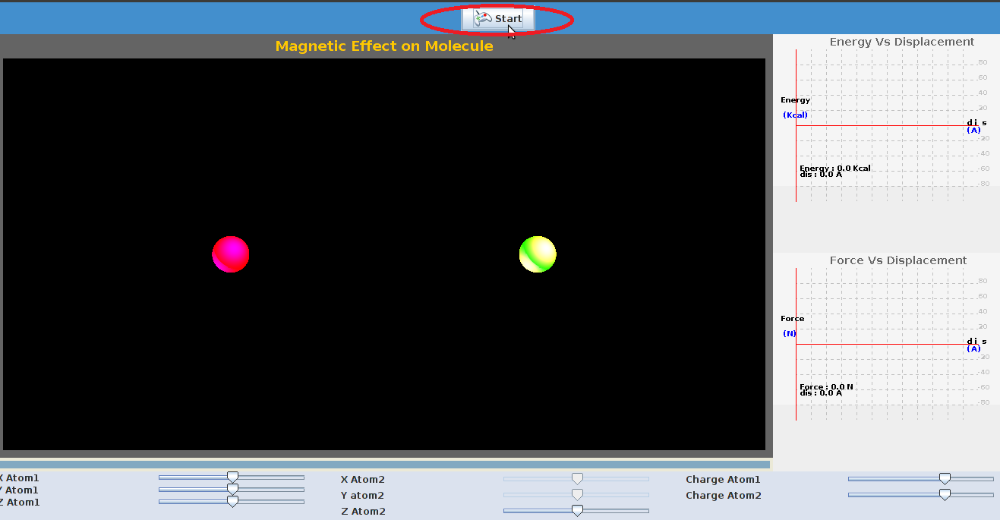
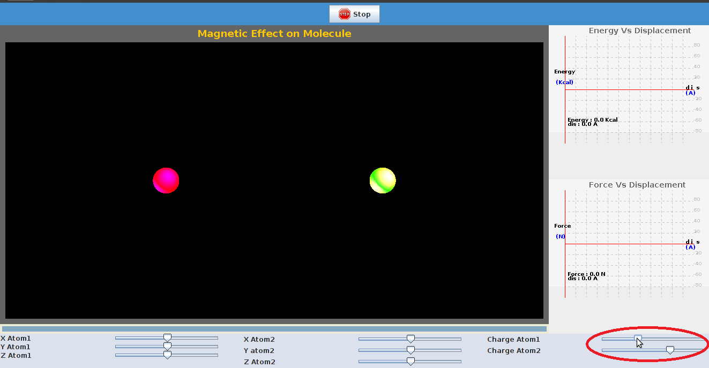
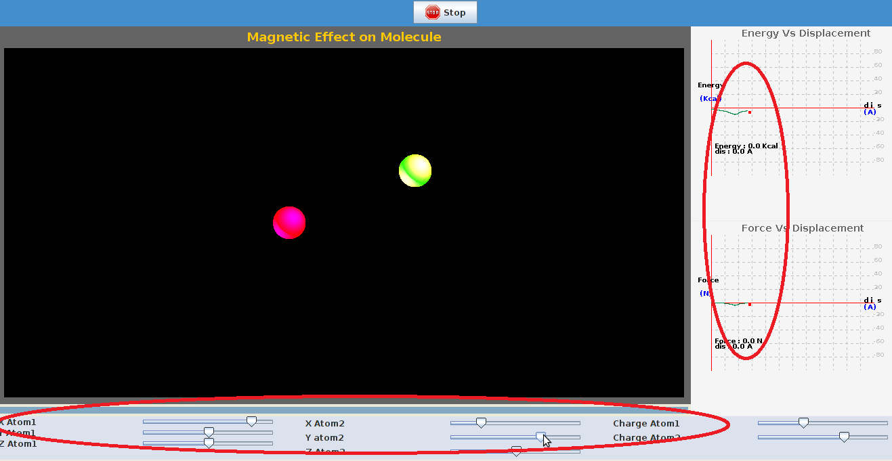

There are certain parameters to be initialized and the procedure detailed here can be followed.  

STEP 1:Click on 'start to start the experiment.  

  

Step 2: The charge on the both the particles can be varied by varying the position of the slider.  

  

Step 3: The coordinates of particles can be changed by changing the position of slider, a plot of force, energy is seen.  

