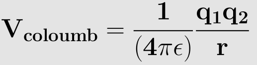
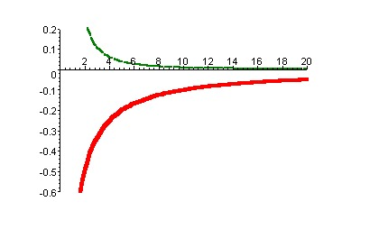

The coulomb potential is an effective pair potential is an effective pair potential that describes the interactions between the two point charges. This acts along the line connecting two charges. This is given by the following equation: 

  

r - distance between the two point charges.

q1, q2 are electric charges in coloumbs carried by charge1 and charge2. ε0 - electrical permittivity of the space.

Two opposite charge particles gives an attractive potential, whereas if charge on the both particles is same it leads an repulsive potential. The resulting potential is as shown in the figure below:

  

This plot shows the variation of coulomb potential with distance in nanometers. The bottom part represents potential between opposite charge i.e., attractive potential, the top part in the figure represents the potential between like charges i.e., repulsive.

Electrostatic potential decays slowly with distance.
